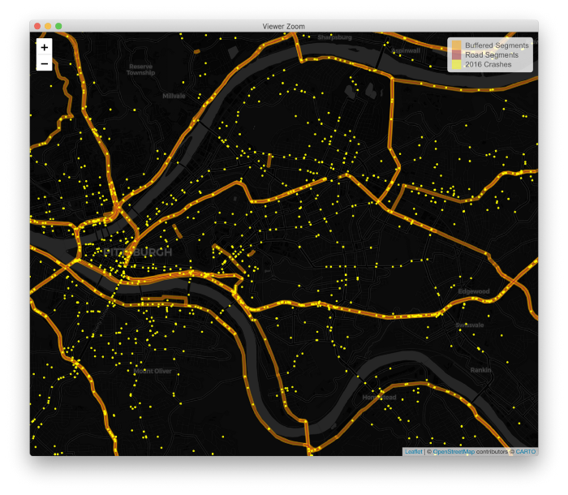
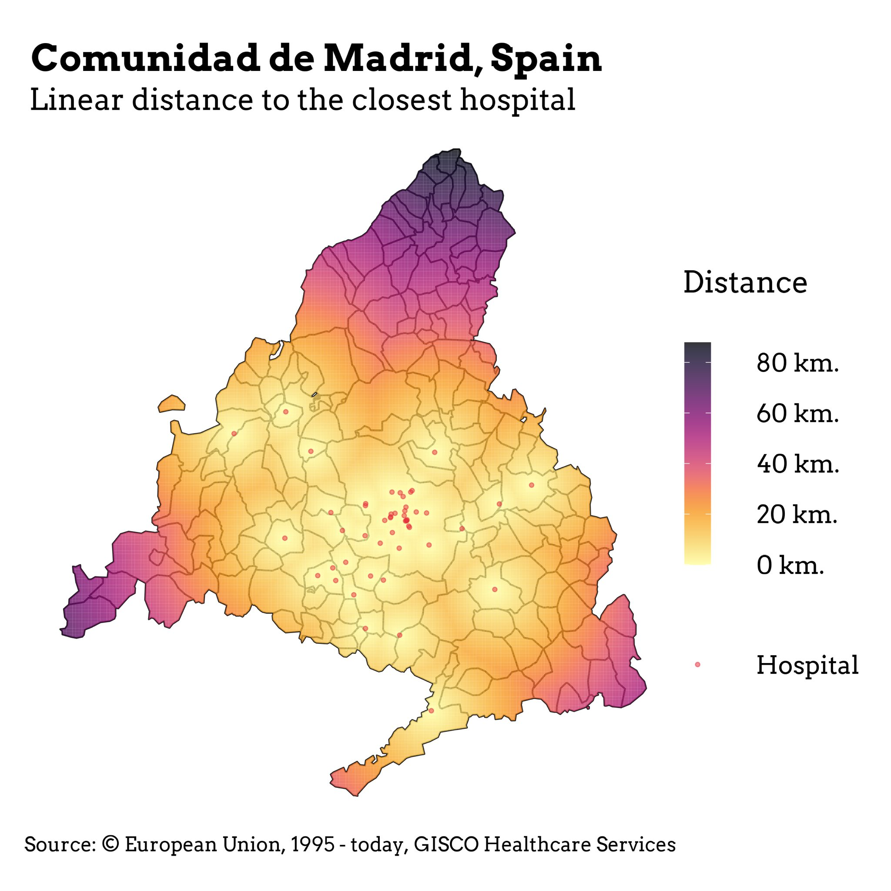
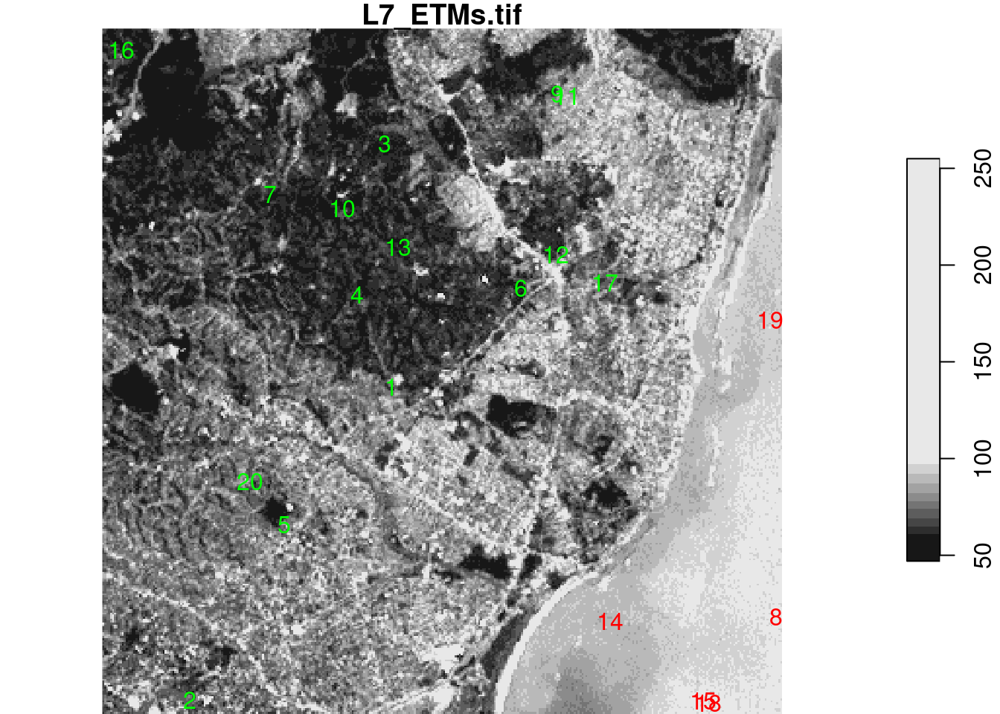

class: middle

```{r setup, include=FALSE}

knitr::opts_chunk$set(warning = FALSE, message = FALSE)

```

.pull-left[

* .orange[**Personal Background**]: Born and raised in the Rio Grande Valley. I've lived in Austin for 11 years.

* .orange[**Education**]: Government and Spanish BA, Global Policy Studies MA with a certificate in Data Science for Policy Analysis and the Statistical Modeling Portfolio 

* .orange[**Role at RGK**]: data science consulting with the CONNECT Program, program evaluation, data visualization and dashboarding for RGK clients, algorithm development
]

.pull-right[


```{r aisd, echo=FALSE, out.width="500px"}
knitr::include_graphics("assets/images/AISD.png")

```

<br/>

```{r rgk, echo=FALSE, out.width="500px"}
knitr::include_graphics("assets/images/RGK.png")
```


]

---
class: inverse, center, middle
background-image: url("assets/images/africa.png")
background-size: contain

--

# R for Geospatial Anlaysis 

---
class: middle

# What can you do with R 

.pull-left[

* Static Maps
* Interactive Mapping Applications
* 3D Mapping and lidar integration 
* Geospatial Data Science 
* Transportation Modeling
]

.pull-right[

```{r pitts, echo=FALSE, out.width="500px"}

```

.tl.footnote-small[
([Source: Mark Egge](https://towardsdatascience.com/five-essential-skills-for-transportation-data-science-8c4bed72c03e))
]

]

---
## Static Maps 

.pull-left[

```{r madrid, echo=FALSE, out.width="500px"}

```


]

.pull-right[

### Important packages

* sf
* ggplot2
* rnaturalearth
* stars 
* terra
* sp (old)
* tmap (old)
* rgdal (old)

]

---
class: center, middle
background-image: url("assets/images/nyc2.jpeg")
background-size: contain

---
class: middle, inverse

## Interactive Mapping Applications

.pull-left[
* Leaflet 

* Tmap 

* Mapdeck 

* Highcharter

* Plotly (also in Python)

* Shiny integration to create advanced applications
]


.pull-right[
[Coronary Disease in the United States](https://rpubs.com/tshapiro/coronarydisease)

```{r usa, echo=FALSE, out.width="500px"}
knitr::include_graphics("assets/images/usa.jpg")
```

.tl.footnote-small[
([Source: Tanya Shapiro](https://twitter.com/tanya_shapiro))
]

]
---
class: middle

## R Shiny for beautiful mapping Dashboards

---
class: inverse, middle

## Focus for this session!


* manipulating GIS data with `sf` package

* creating static maps with `ggplot2`

* creating interactive plots with `leaflet`

---
class: middle 

## Two types map data 

1. Vector
    + multipolygons
    + points
    + lines
    + anything with exact longitude latitude

2. Raster
    + set up in a grid
    + think pixels!

---
class: middle, center, inverse

## Vector Data 

```{r vector, echo = FALSE}
library(sf)
par(mfrow = c(2,4))
par(mar = c(1,1,1.2,1))

# 1
p = st_point(0:1)
plot(p, pch = 16)
title("point")
box(col = 'grey')

# 2
mp = st_multipoint(rbind(c(1,1), c(2, 2), c(4, 1), c(2, 3), c(1,4)))
plot(mp, pch = 16)
title("multipoint")
box(col = 'grey')

# 3
ls = st_linestring(rbind(c(1,1), c(5,5), c(5, 6), c(4, 6), c(3, 4), c(2, 3)))
plot(ls, lwd = 2)
title("linestring")
box(col = 'grey')

# 4
mls = st_multilinestring(list(
  rbind(c(1,1), c(5,5), c(5, 6), c(4, 6), c(3, 4), c(2, 3)),
  rbind(c(3,0), c(4,1), c(2,1))))
plot(mls, lwd = 2)
title("multilinestring")
box(col = 'grey')

# 5 polygon
po = st_polygon(list(rbind(c(2,1), c(3,1), c(5,2), c(6,3), c(5,3), c(4,4), c(3,4), c(1,3), c(2,1)),
    rbind(c(2,2), c(3,3), c(4,3), c(4,2), c(2,2))))
plot(po, border = 'black', col = '#ff8888', lwd = 2)
title("polygon")
box(col = 'grey')

# 6 multipolygon
mpo = st_multipolygon(list(
    list(rbind(c(2,1), c(3,1), c(5,2), c(6,3), c(5,3), c(4,4), c(3,4), c(1,3), c(2,1)),
        rbind(c(2,2), c(3,3), c(4,3), c(4,2), c(2,2))),
    list(rbind(c(3,7), c(4,7), c(5,8), c(3,9), c(2,8), c(3,7)))))
plot(mpo, border = 'black', col = '#ff8888', lwd = 2)
title("multipolygon")
box(col = 'grey')

# 7 geometrycollection
gc = st_geometrycollection(list(po, ls + c(0,5), st_point(c(2,5)), st_point(c(5,4))))
plot(gc, border = 'black', col = '#ff6666', pch = 16, lwd = 2)
title("geometrycollection")
box(col = 'grey')

```

---

## Basic Plotting with`sf`

.pull-left[
```{r firstmap, eval=FALSE}

library(tidyverse)
library(sf)

nc <- system.file("gpkg/nc.gpkg", package = "sf") %>%
    read_sf() 

nc.32119 <- st_transform(nc, 'EPSG:32119')

nc.32119 %>%
    select(BIR74) %>%
    plot(graticule = TRUE, axes = TRUE)


```

.tl.footnote-small[
([Source: Spatial Data Science](https://keen-swartz-3146c4.netlify.app/))
]

]

.pull-right[

```{r firstmap2, echo = FALSE}

library(tidyverse)
library(sf)
nc <- system.file("gpkg/nc.gpkg", package = "sf") %>%
    read_sf() 
nc.32119 <- st_transform(nc, 'EPSG:32119')
nc.32119 %>%
    select(BIR74) %>%
    plot(graticule = TRUE, axes = TRUE)


```
]

---
class: inverse

### Sf creates a special dataframe called an sf object

```{r sfobject}

glimpse(nc)

```

---
class: middle, inverse

### Let's get a closer look at the multipolygon datatype 

```{r closerlook}
nc %>% select(geom) %>% print(n = 10)

```

--

`Each multipolygon is a set of longitude and latitude values`


---
class: inverse

## Integrating `sf` with `ggplot2`

.pull-left[

```{r ggplot2, eval=FALSE}
#Setting the default theme
theme_set(theme_minimal())

#ggplot set up
ggplot(nc) +
  geom_sf(aes(fill = AREA)) + #<<
  labs(title = "Area of North Carolina Counties") +
  theme(
    plot.title = element_text(hjust = 0.5),
    axis.text.x = element_blank(),
    axis.text.y = element_blank(),
    axis.ticks = element_blank(),
  ) +
  scale_fill_viridis_c()


```

]

.pull-right[

```{r ggplot2-2, echo=FALSE}
#Setting the default theme
theme_set(theme_minimal())

#ggplot set up
ggplot(nc) +
  geom_sf(aes(fill = AREA)) + #<<
  labs(title = "Area of North Carolina Counties") +
  theme(
    plot.title = element_text(hjust = 0.5),
    axis.text.x = element_blank(),
    axis.text.y = element_blank(),
    axis.ticks = element_blank(),
  ) +
  scale_fill_viridis_c()


```

]

---
class: middle, center

## Lets look at birthrate and deathrate at once! 


```{r biscale, echo = FALSE}

library(biscale)
library(cowplot)

nc2 = bi_class(nc, x=BIR74, y=SID74,
                   style = "quantile", dim = 3)

map = ggplot() +
  geom_sf(
    data = nc2,
    aes(fill = bi_class),
    size = .1,
    show.legend = F,
    color = "white"
  ) +
  bi_scale_fill(pal = "Brown", dim = 3) +
  coord_sf(expand = F) +
  theme_void() +
  theme(plot.background = element_blank())

legend = bi_legend(pal = "Brown", 
            dim = 3,
            ylab = "Births",
            xlab = "SIDs",
            size = 2.5) + 
  theme(panel.border = element_blank(),
        axis.text = element_blank(),
        axis.title.x = element_text(size = 16, hjust=0, 
                                    color = "white", margin=margin(t=-5)),
        axis.title.y = element_text(size = 16, hjust=0,
                                    color = "white", margin=margin(r=-5)),
        legend.text = element_text(size = 14),
        panel.background = element_blank(),
        panel.grid.major=element_blank(),
        plot.background = element_blank(),
        legend.text.align = 0)

p1 = ggdraw(map) +
  draw_plot(legend, 0.01, 0.05, .4, .4) +
  draw_label("North Carolina (1974)", x=0.04, y=0.94, hjust=0, vjust=0,size=22, color="white", fontface="bold") +
  draw_label("Births vs SIDS", x=0.04, y=0.85, hjust=0, vjust=0, size=18.5, color="white", lineheight = 0.4) + draw_label("#30DayMapChallenge Dec 2021", x=0.8, y=0, size = 15, color="white") +
  theme(plot.background = element_rect(fill="#212A2E", color=NA),
        plot.margin=margin(.5,.5,.5,.5, unit="cm"))

p1
```
.tl.footnote-small[
([Some code from: @leeolney3](https://gist.github.com/leeolney3/8f26d720c1884fccab282bad23dc6038))
]

---
class: middle, inverse

## Use `leaflet` for interactive mapping

.pull-left[

### Features

* Interactive panning/zooming
* Compose maps using arbitrary combinations of:
    * Map tiles
    * Markers
    * Polygons
    * Lines
    * Popups
* Create maps right from the R console
* Embed maps in knitr/R Markdown documents and Shiny apps
* Easily render sf objects, or data frames with latitude/longitude columns

]

.pull-right[

```{r leafletexample, echo=FALSE}
library(leaflet)

m <- leaflet() %>%
  addTiles() %>%  # Add default OpenStreetMap map tiles
  addMarkers(lng=174.768, lat=-36.852, popup="The birthplace of R")
m  # Print the map

```
]

---
class: middle

## Using NC Data

.pull-left[

`sf` objects work seamlessly with `leaflet`!

```{r leaflet2, eval = FALSE}
leaflet(nc) %>% 
  addProviderTiles("CartoDB.Positron") %>% #Tiles are the map background
  addPolygons(color = "#444444") #Counties 

```

]

.pull-right[

```{r leaflet3, echo = FALSE}
leaflet(nc) %>% 
  addProviderTiles("CartoDB.Positron") %>% #Tiles are the map background
  addPolygons(color = "#444444") #Counties 

```

]

---
class: middle

## Adding more complexity

.pull-left[

```{r leaflet4, eval=FALSE}
# set palette
pal <- colorNumeric(palette = "RdBu",n = 5,reverse = FALSE, nc$SID74)

leaflet(nc) %>%
  addProviderTiles("CartoDB.Positron") %>% #Tiles are the map background
  addPolygons(
    color = "#444444",
    weight = 1,
    smoothFactor = 0.5,
    opacity = 1.0,
    fillOpacity = 0.5,
    fillColor = ~ pal(SID74),
    highlightOptions = highlightOptions(color = "white", weight = 2,
      bringToFront = TRUE),
    popup = nc$NAME
  ) %>%
  addLegend(pal = pal, values = ~nc$SID74, position = "bottomright", title = "SIDs")

```

]

.pull-right[

```{r leaflet5, echo = FALSE}
# set palette
pal <- colorNumeric(palette = "RdBu",n = 5,reverse = FALSE, nc$SID74)

leaflet(nc) %>%
  addProviderTiles("CartoDB.Positron") %>% #Tiles are the map background
  addPolygons(
    color = "#444444",
    weight = 1,
    smoothFactor = 0.5,
    opacity = 1.0,
    fillOpacity = 0.5,
    fillColor = ~ pal(SID74),
    highlightOptions = highlightOptions(color = "white", weight = 2,
      bringToFront = TRUE),
    popup = nc$NAME
  ) %>%
  addLegend(pal = pal, values = ~nc$SID74, position = "bottomright", title = "SIDs")

```
]


---
class: center, middle, inverse

## Raster Data 

.pull-left[

```{r rasterized, echo=FALSE}
library(stars)
plot(st_rasterize(nc["BIR74"], dx = 0.1), col = sf.colors(), breaks = "equal")

```

]

.pull-right[

```{r raster_type, echo=FALSE}

x = 1:5
y = 1:4
d = st_dimensions(x = x, y = y, .raster = c("x", "y"))
m = matrix(runif(20),5,4)
r1 = st_as_stars(r = m, dimensions = d)

r = attr(d, "raster")
r$affine = c(0.2, -0.2)
attr(d, "raster") = r
r2 = st_as_stars(r = m, dimensions = d)

r = attr(d, "raster")
r$affine = c(0.1, -0.3)
attr(d, "raster") = r
r3 = st_as_stars(r = m, dimensions = d)

x = c(1, 2, 3.5, 5, 6)
y = c(1, 1.5, 3, 3.5)
d = st_dimensions(x = x, y = y, .raster = c("x", "y"))
r4 = st_as_stars(r = m, dimensions = d)

grd = st_make_grid(cellsize = c(10,10), offset = c(-130,10), n = c(8,5), crs = st_crs(4326))
r5 = st_transform(grd, "+proj=laea +lon_0=-70 +lat_0=35")

par(mfrow = c(2,3), mar = c(0.1, 1, 1.1, 1))
r1 = st_make_grid(cellsize = c(1,1), n = c(5,4), offset = c(0,0))
plot(r1, main = "regular")
plot(st_geometry(st_as_sf(r2)), main = "rotated")
plot(st_geometry(st_as_sf(r3)), main = "sheared")
plot(st_geometry(st_as_sf(r4, as_points = FALSE)), main = "rectilinear")
plot(st_geometry((r5)), main = "curvilinear")

```

]

---
class: middle, center

## Satelitte Images are stored in raster format


```{r raster2, echo=FALSE, out.width="500px"}

```


--
The downside of satellite data is that it is `HUGE!`

---

class: section, left, middle, inverse

# 📚 Resources for R 📚

## Questions? lbjdata.org

#### [#rstats hashtag](https://twitter.com/search?q=%23rstats) on twitter
#### [#rspatial hashtag](https://twitter.com/search?q=%23rspatial) on twitter
#### R For Data Science - [Online Book](https://r4ds.had.co.nz) | [Hard Copy](https://www.oreilly.com/library/view/r-for-data/9781491910382/) | [Slack Community](https://www.rfordatasci.com)
#### [Spatial Data Science](https://keen-swartz-3146c4.netlify.app/) website
#### [Geocomputation with R](https://geocompr.robinlovelace.net/spatial-class.html) website


---

class: section, center, middle, inverse

# 🙏 Thank you 🙏

## Questions? lbjdata.org

### 📧: matthew.worthington@austin.utexas.edu
### 🐦: @mrworthington
### 📧: ethan.tenison@austin.utexas.edu
### 🐦: @ethantenison


