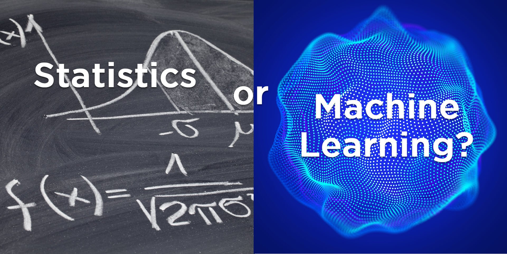
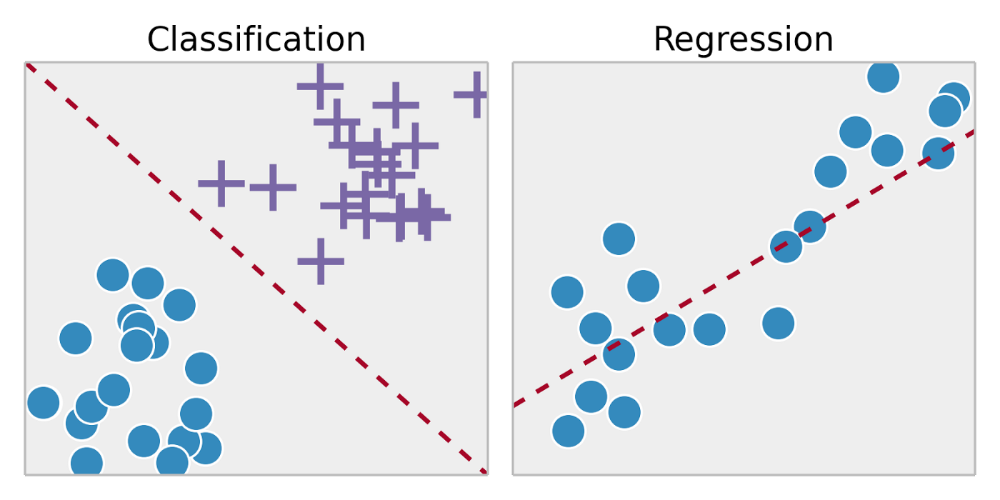
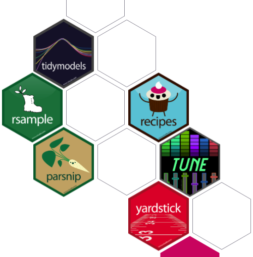

class: middle

.pull-left[

* .orange[**Personal Background**]: Born and raised in the Rio Grande Valley. I've lived in Austin for 11 years.

* .orange[**Education**]: Government and Spanish BA, Global Policy Studies MA with a certificate in Data Science for Policy Analysis and the Statistical Modeling Portfolio 

* .orange[**Role at RGK**]: data science consulting with the CONNECT Program, program evaluation, data visualization and dashboarding for RGK clients, algorithm development
]

.pull-right[


```{r aisd, echo=FALSE, out.width="500px"}


```

<br/>

```{r rgk, echo=FALSE, out.width="500px"}

```


]

---
class: inverse, center, middle
background-image: url("assets/images/modeling2.png")
background-size: contain

---
class: middle


.pull-left[
### R's Stats Focus 

* .orange[**R Origin**]: R was first developed as a statistical language

* .orange[**R strengths**]: Advanced statistical modeling 

* .orange[**Built-in functions**]: linear regression, ANOVA, t-tests  
]

.pull-right[

]


---
class: middle

# What is Statistical Modeling? 

### **Statistical modeling** is the process of applying statistical analysis to a dataset. A statistical model is a mathematical representation (or mathematical model) of observed data.


.tl.footnote-small[
([Credit: Tim Stobierski](https://www.northeastern.edu/graduate/blog/statistical-modeling-for-data-analysis/))
]

---

# Examples of Statistical Models

.pull-left[
* Linear Regression 
* Logistic Regression
* ANOVA
* Tree-based methods
* Discriminant Analysis 
* Principal Component Analysis 
* Clustering Methods 

]

.pull-right[
* Bayesian Methods 
* Matching Methods
* Regression Discontinuity 
* Difference-in-difference
* Synthetic Control 
* etc. etc. 

]

--

# .orange[**SO MANY MODELS**] 
---
class: inverse, middle

### Statistics is Easier than you think
* Statistics gives meaning to math 

* Having a stats professors that does applied work is essential

* LBJ has numerous applied statisticians that can make learning exciting


```{r setup, include=FALSE}
options(htmltools.dir.version = FALSE)
knitr::opts_chunk$set(message = FALSE, warning = FALSE, comment = "", cache = FALSE, fig.retina = 3)
library(flipbookr)        # Makes Step-by-Step Code Demos
library(xaringanExtra)    # Package with Useful Stuff For Making Slides
library(tidyverse)        # What loads the core set of Modern R Packages, like ggplot2
library(tidycensus)       # Tidyverse-friendly connection to Census API
library(janitor)          # Really useful functions for cleaning data
library(lubridate)        # Makes Working With Dates Pretty Easy
library(grid)             # Organizes Visual Objects
library(ggtext)           # Helps with text in ggplot2 objects
library(gt)               # A package for making really nice tables in R
library(gtExtras)
library(flair)
library(htmlwidgets)
library(xaringan)
library(palmerpenguins)   # test dataset that isn't racist 
library(dotwhisker)       # for visualizing regression results
library(vip)

```

---
class: middle

### Statistics vs Machine Learning

.pull-left[

* **BOTH STATISTICS**

* The boundary is fuzzy

* ML usually refers to **predictive** statistical models 

* ML is (usually) **NOT** interested in casual inference 
]

.pull-right[

```{r ml_vs_stats, echo=FALSE, out.width="500px"}


```


]

---
class: inverse, middle

### Two Main Categories in Machine Learning 

.pull-left[


.orange[**Supervised Learning**]:
* Predictive modeling! 
* Uses labeled datasets 
* Think regression. 


.orange[**Unsupervised Learning**]: 
* Data discovery
* Uses unlabeled data to discover patterns 
* Clustering algorithms 
]

.pull-right[


```{r super_vs_un, echo=FALSE, out.width="500px"}
knitr::include_graphics("assets/images/supervised-vs-unsupervised-ml.png")
```


]


---
class: inverse, middle

### Supervised learning (AKA Predictive Analytics)

.pull-left[

* .orange[**Regression**]: use an algorithm to accurately assign test data into specific categories, such as separating apples from oranges

* .orange[**Classification**]: uses an algorithm to understand the relationship between dependent and independent variables. Regression models are helpful for predicting numerical values based on different data points

.tl.footnote-small[
([Definitions from: IBM](https://www.ibm.com/cloud/blog/supervised-vs-unsupervised-learning))
]
]

.pull-right[


```{r class_reg, echo=FALSE, out.width="500px"}

```


]
---
class: middle, center 

#### The Russian nesting dolls of this workshop~

```{r russian_netsting, echo=FALSE, out.width="700px"}
knitr::include_graphics("assets/images/nesting_dolls.jpg")
```


---
class: inverse,center

```{r jobs, echo=FALSE, out.width="600px" }
knitr::include_graphics("assets/images/jobs.jpg")
```

.tl.footnote-small[
([Credit: Visual Capitalist](https://www.visualcapitalist.com/the-20-fastest-growing-jobs-in-the-next-decade/))
]
---

### Basic Statistics in base R

.pull-left[


```{r elem}

mean(penguins$bill_length_mm, na.rm = TRUE)

median(penguins$bill_length_mm, na.rm = TRUE)

max(penguins$bill_length_mm, na.rm = TRUE)

quantile(penguins$bill_length_mm, c(.25,.50,.75), na.rm = TRUE)


```
.tl.footnote-small[
([Credit: palmerpenguins](https://allisonhorst.github.io/palmerpenguins/))
]

]

.pull-right[

```{r palmer, echo=FALSE, out.width="350px" }
knitr::include_graphics("assets/images/palmer.png")

```

]


---
class: middle

### Correlation and Linear Models 

* **Correlation**: Correlation is a statistical measure that expresses the extent to which two variables are linearly related (meaning they change together at a constant rate). It’s a common tool for describing simple relationships without making a statement about cause and effect.

* **How is correlation measured?**
The sample correlation coefficient, r, quantifies the strength of the relationship. Correlations are also tested for statistical significance.


```{r int}

#Correlation
cor(penguins$bill_length_mm, penguins$body_mass_g,
    method = "pearson", use = "complete.obs")

```

---


.pull-left[

### Linear Regression 

* The aim of linear regression is to model a continuous variable Y as a mathematical function of one or more X variable(s), so that we can use this regression model to predict the Y when only the X is known.

* This mathematical equation can be generalized as follows:
$$y = \beta_0 + \beta_1 X + \varepsilon $$

* where, β1 is the intercept and β2 is the slope. Collectively, they are called regression coefficients. ϵ is the error term, the part of Y the regression model is unable to explain.


]

.pull-right[
### Simple Linear Regression 


.tl.footnote-small[
([Credit: r-statistics.co](http://r-statistics.co/Linear-Regression.html))
]

]

---
class: inverse, middle

# All the code needed for basic linear regression in R!


```{r lm}
#Linear Model AKA Linear Regression 
lm(body_mass_g ~ flipper_length_mm + bill_length_mm, data = penguins)
```

* In R `~` defines a relationship being the dependent and independent variables

* Use `+` to list all of the independent variables  
---
class:middle

### Problems with base R stats

* inconsistent naming conventions

* Statistics has advanced **SO** much since 1995

* As a result, most people rely on statistical packages in R

---
class: inverse, center, middle

# Tidymodels to the rescue! 

```{r tdmodels, echo=FALSE, out.width="350px" }


```


---

class: inverse, center, middle
background-size: contain
background-image: url("assets/images/tidymodels2.png")

---
class: inverse, center, middle

### Follow Tidymodels creator Julia Silge! 

```{r julia, echo=FALSE, out.width="500px" }
knitr::include_graphics("assets/images/julia_silge.jpg")

```


---
class: inverse, middle

### Hypothesis generation vs. hypothesis confirmation


Modeling can be used to generate hypotheses or confirm them. We do this by separating our data into training and test sets
+ Observations can either go into the training or test sets, not both. 

+ You can use an observation in your training data as much as you'd like to explore, but you can only use the test data when you're ready to confirm your hypothesis 

Depending on the size of your data set you can separate it into 75% training and 25% test. 


---

### Using `rsample` to create test/train datasets

```{r rsample}
library(tidymodels) # for the parsnip package, along with the rest of tidymodels
library(dotwhisker) # for visualizing regression results

# Fix the random numbers by setting the seed 
# This enables the analysis to be reproducible when random numbers are used 
set.seed(27)
# Put 3/4 of the data into the training set 
data_split <- initial_split(penguins, prop = 3/4)

# Create data frames for the two sets:
train_data <- training(data_split)
test_data  <- testing(data_split)

```

.pull-left[

```{r}
glimpse(train_data, width = 50)
        
```
]

.pull-right[
```{r}
glimpse(test_data, width = 50)
        
```
]


---

### How to pick what model to use? 

.pull-left[


1. Determine the shape of your data

2. Create a formula based on what variables are important 

3. Fit your model to the data 

* `body_mass_g ~ bill_length_mm`

]

.pull-right[


```{r, fig.height=6}


ggplot(train_data, aes(x = bill_length_mm, y = body_mass_g)) + 
  geom_point()
```


]

--- 
class: inverse, center, middle

# .orange[**All models are wrong, but some are useful.**]

.tl.footnote-small[
George Box - Statistician
]

---
class: middle, center


`body_mass_g ~ bill_length_mm + species`


```{r adv_regression2, echo= FALSE}
theme_set(theme_minimal())

ggplot(train_data, aes(x = bill_length_mm, y = body_mass_g, color = species)) + 
  geom_point() +
  geom_smooth(method = "lm", se = FALSE) + #lm refers to a regression
  scale_color_viridis_d(option = "plasma", end = .7)
```


---
class: inverse, middle

### Build model with parsnip 

1) Set model specification 
```{r define}

linear_reg()
# Linear Regression Model Specification (regression)

```

--
2) Set the engine 

```{r set_engine}
linear_reg() %>% 
  set_engine("lm")
#> Computational engine: lm

```


.tl.footnote-small[
([tidymodels.org](https://www.tidymodels.org/))
]

---

### Fit your model 

First save as an object

```{r}
lm_mod <- 
  linear_reg() %>% 
  set_engine("lm")
```

Then use `fit()` to train your model 

> by adding a dot "." after the ~ we can select all variables as predictors 

```{r}

lm_fit <- 
  lm_mod %>% 
  fit(body_mass_g ~ ., 
      data = train_data)

```

---
### Automatically see the coefficients

```{r basic_lm}
lm_fit
```

--
### A little messy!

---
class: middle, inverse, center 

### Organize your model results with the `tidy()` function

```{r tidied}
tidy(lm_fit)
```


---
class: middle, inverse 

.pull-left[

### See confidence intervals with dot and whisker plot 

```{r dotwhisker, eval=FALSE}
tidy(lm_fit) %>% 
  dwplot(dot_args = list(size = 2, color = "black"),
         whisker_args = list(color = "black"),
         vline = geom_vline(xintercept = 0, colour = "grey50", linetype = 2))
```

]

.pull-right[

```{r dotwhisker2, echo=FALSE}
tidy(lm_fit) %>% 
  dwplot(dot_args = list(size = 2, color = "black"),
         whisker_args = list(color = "black"),
         vline = geom_vline(xintercept = 0, colour = "grey50", linetype = 2))
```
]
---

### Prediction 

Predicting the weights of the penguins from the test dataset 

```{r}

pred <- predict(lm_fit, new_data = test_data)

pred
```

---

--- 

### Evaluating Performance 

.pull-left[
Instantly evaluate if your regression model satisfies all the model assumptions


```{r model_assumptions, eval=FALSE}
par(mfrow = c(2, 2)) # plot all 4 plots in one plot

plot(lm_fit$fit,  # Select the fit object from the lm_fit list object 
     pch = 16,    # optional parameters to make points blue
     col = '#006EA1')
```
]

.pull-right[

```{r model_assumptions2, echo=FALSE}
par(mfrow = c(2, 2)) # plot all 4 plots in one plot

plot(lm_fit$fit,  # Select the fit object from the lm_fit list object 
     pch = 16,    # optional parameters to make points blue
     col = '#006EA1')
```

]
---
class: center, middle, inverse

### Performance metrics

Use `glance()` to see evaluation metrics for the entire model 

```{r model_eval}
glance(lm_fit)
```

---
class: inverse

### Easily test variable importance

```{r vip, out.height="400px"}
vip(lm_fit)
```
---
--- 

### Check for accuracy 

### 1) Bind test results to original test dataset 

```{r bindcols}
test_results <- predict(lm_fit, new_data = test_data) |>
  bind_cols(test_data)

#View Results
test_results
```

---
class: middle

.pull-left[

### 2) Visualize your results 

Test how good your regression results are by comparing the actual value by the predicted value 

```{r test, eval=FALSE}
ggplot(data = test_results,
       mapping = aes(x = .pred, y = body_mass_g)) +
  geom_point(color = '#006EA1') +
  geom_abline(intercept = 0, slope = 1, color = 'orange') +
  labs(title = 'Linear Regression Results - Test Set',
       x = 'Predicted Weight',
       y = 'Actual Weight')
```

]

.pull-right[
```{r test2, echo=FALSE}
ggplot(data = test_results,
       mapping = aes(x = .pred, y = body_mass_g)) +
  geom_point(color = '#006EA1') +
  geom_abline(intercept = 0, slope = 1, color = 'orange') +
  labs(title = 'Linear Regression Results - Test Set',
       x = 'Predicted Weight',
       y = 'Actual Weight')
```

]
---

class: section, left, middle, inverse

# 📚 Resources for R 📚

## Questions? lbjdata.org

#### [#rstats hashtag](https://twitter.com/search?q=%23rstats) on twitter
#### R For Data Science - [Online Book](https://r4ds.had.co.nz) | [Hard Copy](https://www.oreilly.com/library/view/r-for-data/9781491910382/) | [Slack Community](https://www.rfordatasci.com)
#### [Tidymodels](https://www.tidymodels.org/) website
#### [Introduction to Statistical Learning](https://emilhvitfeldt.github.io/ISLR-tidymodels-labs/index.html) Tidymodels Version


---

class: section, center, middle, inverse

# 🙏 Thank you 🙏

## Questions? lbjdata.org

### 📧: matthew.worthington@austin.utexas.edu
### 🐦: @mrworthington
### 📧: ethan.tenison@austin.utexas.edu
### 🐦: @ethantenison


